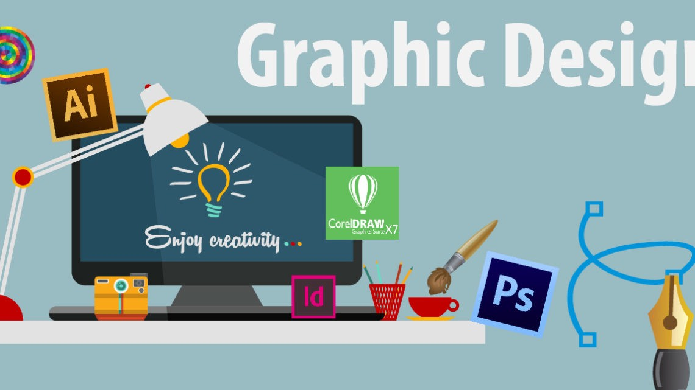

Setelah lulus saya beercita-cita menjadi seorang graphic designer. Sudah lama saya suka menggambar namun tidak terlalu bisa menggambar menggunakan pensil atau alat lukis lainnya, sehingga saya belajar menggunakan corelDraw dan Photoshot.

Saya sudah beberapakali membuat gambar seperti vector art dan beberapa kali mendesign untukk keperluan organisasi. Disaat-saat masuk kuliah ketika saya tidak memiliki tugas kuliah atau tugas dirumah, terkadang saya menyempatkan diri untuk menggambar vector art.

Maka dari itu semoga setelah lulus, keinginan saya untuk menjadi seorang graphic designer dapat tercapai dan dapat membawa manfaat untuk banyak pihak, serta saya akan selalu belajar hal baru mengenai graphig design atau pun banyak hal lain yang dapat membantu saya.