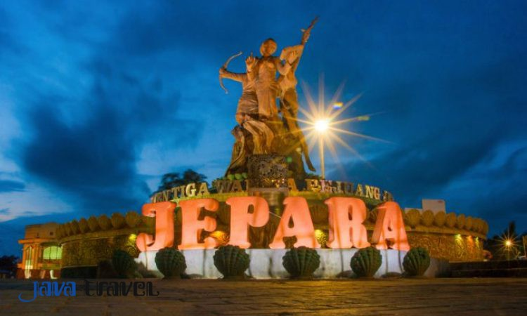

## **Lokasi dan Asal Usul Jepara**

Kabupaten Jepara adalah salah satu kabupaten di Provinsi Jawa Tengah. Ibukotanya adalah Jepara. Kabupaten Jepara terletak di pantura timur Jawa Tengah, dimana bagian barat dan utara dibatasi oleh laut. Bagian timur wilayah kabupaten ini merupakan daerah pegunungan.

Dua pulau terbesarnya adalah Pulau Karimunjawa dan Pulau Kemujan. Sebagian besar wilayah Karimunjawa dilindungi dalam Cagar Alam Laut Karimunjawa. Penyeberangan ke kepulauan ini dilayani oleh kapal ferry yang bertolak dari Pelabuhan Jepara. Karimunjawa juga terdapat Bandara Dewandaru yang didarati pesawat dari Bandara Ahmad Yani Semarang.

Pada zaman Kerajaan Kalinyamat yang dipimpin Sultan Hadlirin ayah angkatnya yang berasal dari Cinamengukir batu yang dia bawa dari Cina untuk di letakan di Masjid Mantingan. Lalu dia mengajarkan cara mengukir yang indah kepada warga Jepara sampai sekarang. maka Jepara di juluki **Kota Ukir.**

## **Tempat wisata di Jepara**

Banyak orang mengenal Kabupaten Jepara karena keberadaan Kepulauan Karimunjawa yang disebut sebagai salah satu "surga" bawah laut di Indonesia. Padahal masih banyak tempat wisata alam yang ada di Jepara, wisata darat ataupun wisata air.

Tempat wisata yang paling terkenal di Jepara yaitu Taman Nasional Karimunjawa. Disana pengunjung dapat melakukan *snorkeling* untuk menyaksikan indahnya biota laut, singgah di penangkaran hiu, *tracking* ke hutan mangrove, mengunjungi banyak pantai sekaligus, wisata kuliner, hingga wisata religi.

Karena Jepara berlokasi dibagian timur Jawa Tengah, maka Jepara dikelilingi oleh laut. beberapa pantai yang terkenal yaitu Pantai Kartini, Pantai Bondo, Pantai Punuk Sapi, dan masih banyak lagi.

Ada juga tempat sejarah seperti Benteng Portugis dan Museum Kartini. Ada juga patung Tiga Srikandi Jepara yang merupakan tokoh dari Jepara yaitu Ibu Kartini yang terkenal sebagai pahlawan emansipasi wanita, Ratu Kalinyamat yang merupakan seorang ratu yang sangat sakti dan seorang penguasa di Jepara pada zaman dahulu, dan Ratu Shima yang merupakan seorang pemimpin di Kerajaan Kalingga yang dikenal sebagai seorang pemimpin yang jujur dan tegas.